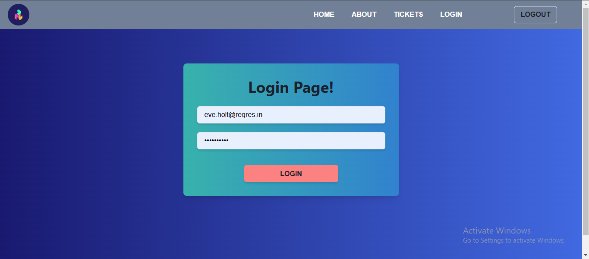

# Mini Tickets Create Website

## This Website works for all the Devices - (Laptops, Tabs, Mobiles) --> (Fully Responsive)

Here is an image of my Ticket Website in the README:-

*This project uses the [Reqres API](https://reqres.in/) for HTTP requests.*

# (Front-End)

### Pages
 - Home Page
 - About Page
 - Tickets Page
 - Login Page
 - Ticket Details/View Page
 - Ticket Edit Page
 - Ticket Create Page

### Styling
 - Using `Chakra-UI`
 - React-Toastify

### Functionality
 - Login functionality build with use `reqres.in` that is a fakeStore-API
 - Reqres.in Email and Password for Login my Website
      - EMAIL : eve.holt@reqres.in
      - PASSWORD : cityslicka
  
 - CRUD Operations on ticket:-
      - `fetch-tickets`  Functionality
      - `create-tickets`  Functionality
      - `update-tickets`  Functionality
      - `delete-tickets`  Functionality
  
 - Private Routing Page (for logged in users)
 - Navigate one page to another page
  
 - Sorting and Filtering Functionality on Tickets
     - Sort by Priority
     - Filter by Status

### Responsive
 - Responsive for all devices `Laptops, Tabs, Mobiles`

### Build With
 - Build using `NPM`
 - Vite + React

# (Back-End)
 - Using `db.json`
  
 - CRUD Operations on Ticket
     - Add new tickects in db
     - Update the tickets in db
     - delete the tickets from db

